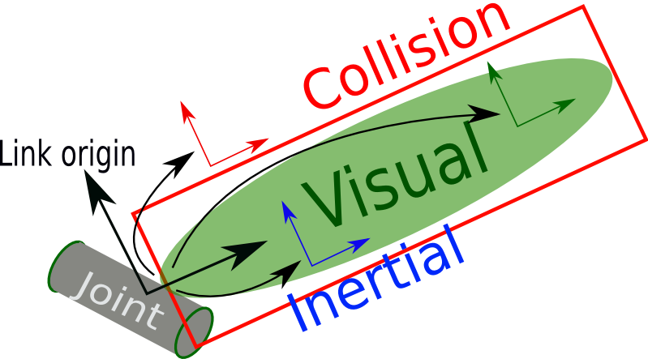
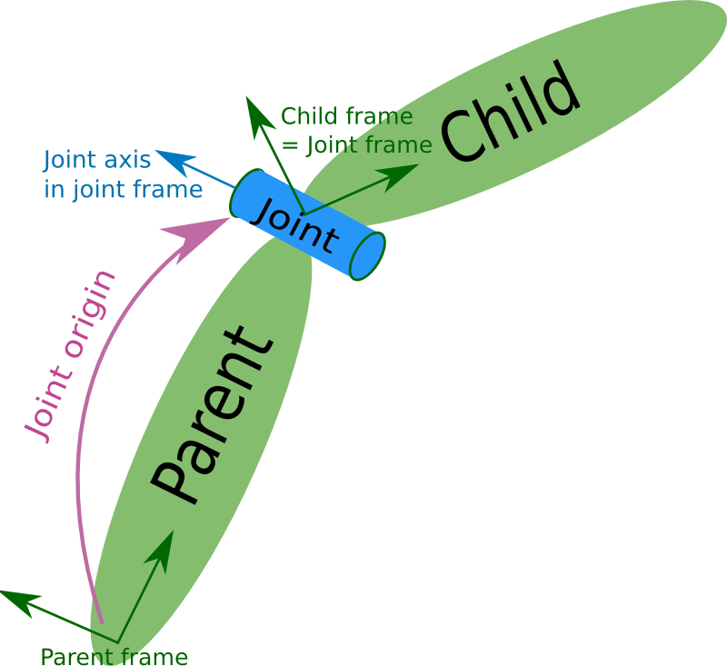

# sdf

## 参考

- sdf教程：http://sdformat.org/tutorials

- 模型库：https://app.gazebosim.org/fuel

## 格式说明

参考：https://link.zhihu.com/?target=http%3A//sdformat.org/spec

### Link



### Joint



- Pose

  该元素定义Joint在Child frame下的坐标。

  默认Joint的origin与Child Link的原点重合，也即pose元素都为0：

  ```shell
  <pose frame=''>0 0 0 0 0 0</pose>
  ```

  我们可以通过Pose定义Joint frame在Child frame下的坐标与旋转，例如下图：

  

  也就是坐标为(0.1 0 0)，旋转为(0.5 -0 0)，对应的pose为：

  ```shell
  <pose frame=''>0.1 0 0 0.5 -0 0</pose>
  ```

  > Child frame的旋转是在Joint frame下的。


